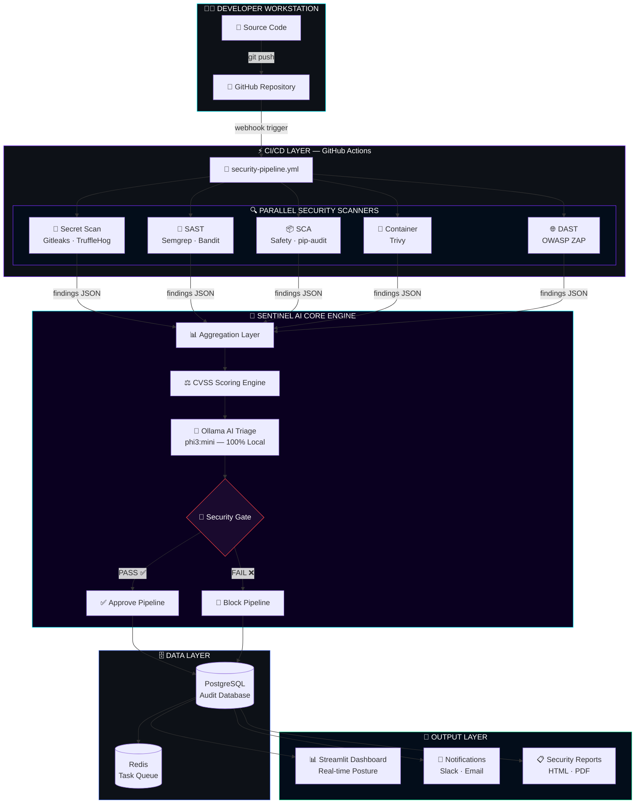
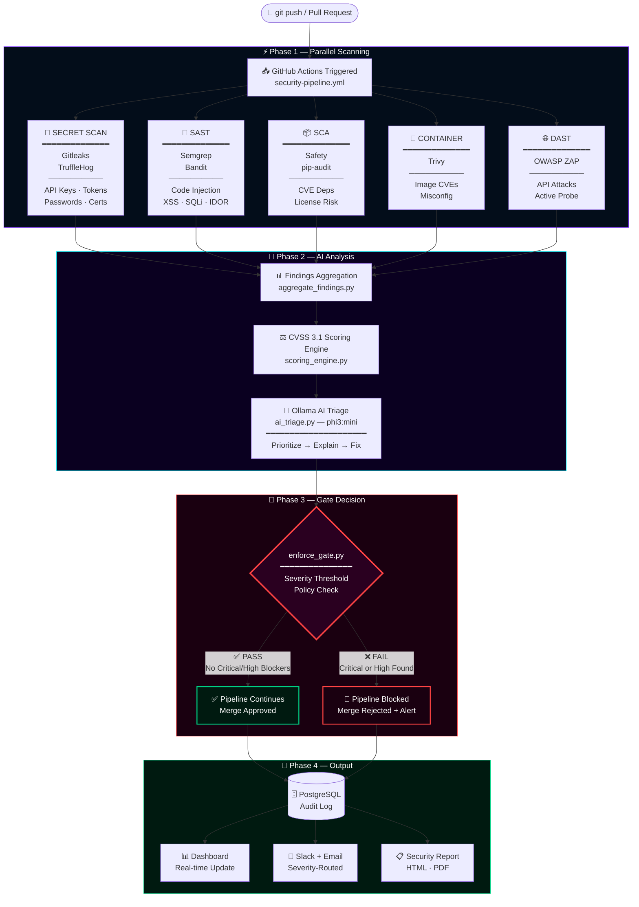
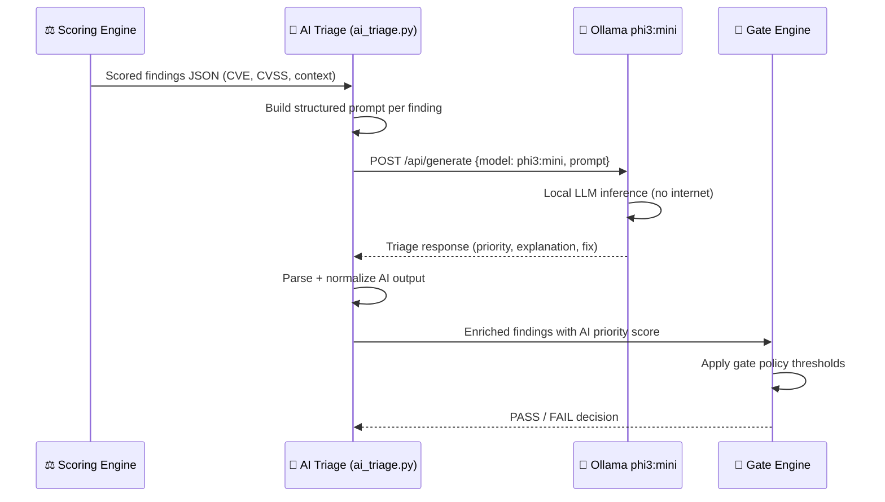
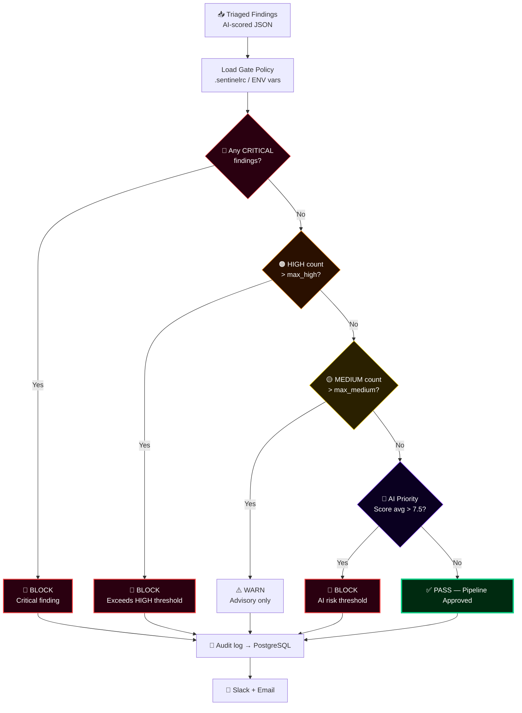

<div align="center">


</div>

<div align="center">

[](https://python.org)
[](https://fastapi.tiangolo.com)
[](https://ollama.com)
[](https://docker.com)
[](https://kubernetes.io)

[](https://github.com/features/actions)
[](#)
[](https://postgresql.org)
[](https://redis.io)
[](https://streamlit.io)

[](LICENSE)
[](#)
[](#)
[](#)
[](#)
[](#-contributing)

<br/>

> **🛡️ Shift-Left. Automate. Triage. Secure.**
>
> *Enterprise-grade AI-powered security orchestration that embeds into every commit, every build, every deployment.*

<br/>

[**🚀 Quick Start**](#-installation) · [**📖 Overview**](#-overview) · [**🏗️ Architecture**](#-architecture) · [**🤖 AI Engine**](#-ai-triage-engine) · [**📊 Dashboard**](#-dashboard-preview)

</div>

---

<details>
<summary><b>📋 Table of Contents — Click to Expand</b></summary>

<br/>

| # | Section |
|:--|:--------|
| 01 | [🌐 Overview](#-overview) |
| 02 | [⚠️ Problem Statement](#-problem-statement) |
| 03 | [💡 Solution](#-solution) |
| 04 | [✨ Features](#-features) |
| 05 | [🏗️ Architecture](#-architecture) |
| 06 | [🔐 Security Pipeline](#-security-pipeline) |
| 07 | [🤖 AI Triage Engine](#-ai-triage-engine) |
| 08 | [📊 Dashboard Preview](#-dashboard-preview) |
| 09 | [⚙️ Installation](#-installation) |
| 10 | [🐳 Docker Setup](#-docker-setup) |
| 11 | [☸️ Kubernetes Deployment](#-kubernetes-deployment) |
| 12 | [🔄 GitHub Actions](#-github-actions) |
| 13 | [🧠 Local AI Setup](#-local-ai-setup) |
| 14 | [📁 Project Structure](#-project-structure) |
| 15 | [🚦 Security Gate Logic](#-security-gate-logic) |
| 16 | [🧪 Testing](#-testing) |
| 17 | [🔮 Future Enhancements](#-future-enhancements) |
| 18 | [🤝 Contributing](#-contributing) |
| 19 | [📄 License](#-license) |
| 20 | [👤 Author](#-author) |

</details>

---

## 🌐 Overview

<table>
<tr>
<td width="58%">

**Sentinel AI** is a final-year capstone project and production-ready platform that solves one of modern software engineering's most critical challenges: **security that keeps pace with development velocity**.

Traditional security reviews are manual, slow, and bolt-on. Sentinel AI **embeds intelligent security directly into the CI/CD pipeline** — scanning every push, every pull request, and every deployment automatically, then using a **local Ollama AI model** to triage, prioritize, and explain every finding in plain language.

The result: developers get actionable security feedback in minutes, not weeks. Security becomes a continuous, automated engineering discipline — not a last-minute checkbox.

### At a Glance

| Property | Value |
|:----------|:-------|
| 🎯 **Type** | AI-Powered DevSecOps Platform |
| 🧠 **AI Engine** | Ollama · phi3:mini (100% Local) |
| 🔍 **Scan Coverage** | Code · Deps · Containers · APIs · Secrets |
| 🚦 **Gate Decision** | Automated Pass/Fail with CVSS Scoring |
| 📊 **Dashboard** | Real-time Streamlit + Plotly |
| 📦 **Deployment** | Docker · Docker Compose · Kubernetes |
| 🔔 **Alerts** | Slack + Email |

</td>
<td width="42%" align="center">

```
╔═══════════════════════════════╗
║     SENTINEL AI — POSTURE     ║
╠═══════════════════════════════╣
║                               ║
║  🔍 Scans Running  ●●●●●○○○○  ║
║  🧠 AI Triage      ●●●●●●●○○  ║
║  🚦 Gate Status    ✅  PASS    ║
║                               ║
║  Critical  ██░░░░░░░░   2     ║
║  High      ████░░░░░░   7     ║
║  Medium    ████████░░  18     ║
║  Low       ██████████  34     ║
║                               ║
║  CVSS Avg Score:   5.3 / 10   ║
║  AI Confidence:      96.8%    ║
║  Last Scan:      2 mins ago   ║
║                               ║
╚═══════════════════════════════╝
```

</td>
</tr>
</table>

---

## ⚠️ Problem Statement

<div align="center">

```
┌──────────────────────────────────────────────────────────────────────┐
│                                                                      │
│   "83% of codebases contain open-source vulnerabilities."            │
│   "The average time to remediate a critical CVE is 84 days."         │
│   "Only 1 in 3 organizations perform automated security scanning."   │
│                                               — Synopsys OSSRA 2024  │
│                                                                      │
└──────────────────────────────────────────────────────────────────────┘
```

</div>

Modern development teams push code dozens of times per day. Traditional security practices cannot keep up:

- 🔴 **Manual Code Reviews** are slow, inconsistent, and don't scale
- 🔴 **Siloed Security Teams** create bottlenecks and knowledge gaps
- 🔴 **Alert Fatigue** from noisy scanners causes critical findings to be ignored
- 🔴 **No AI Context** — scanners report *what* but not *why it matters* or *how to fix it*
- 🔴 **Late-Stage Discovery** — vulnerabilities found in production cost 30× more to fix
- 🔴 **Cloud AI Dependencies** — most AI security tools require sending code to external APIs

---

## 💡 Solution

Sentinel AI addresses every one of these pain points through a unified, automated, AI-augmented security fabric:

<div align="center">

| Problem | Sentinel AI Solution |
|:--------|:---------------------|
| Manual reviews are slow | ⚡ Automated scanning on every `git push` via GitHub Actions |
| Siloed security | 🔗 Security embedded directly in the developer workflow |
| Alert fatigue | 🧠 AI triage filters noise and surfaces what truly matters |
| No remediation guidance | 💬 Ollama AI explains findings and suggests fixes in plain language |
| Late discovery | 🔀 Shift-left: security gates block merges before code reaches production |
| Cloud AI privacy risk | 🔒 100% local AI — your code never leaves your infrastructure |

</div>

---

## ✨ Features

<div align="center">

### 🔍 Multi-Vector Security Scanning

</div>

<table>
<tr>
<td width="50%">

**Secret & Credential Detection**
- 🔑 600+ secret patterns via **Gitleaks**
- 🔍 Git history deep-scan via **TruffleHog**
- 📊 Entropy analysis for high-confidence detection
- 🚫 Pre-commit and CI-time blocking

**Static Analysis (SAST)**
- 🔬 Multi-language AST analysis via **Semgrep**
- 🐍 Python security audit via **Bandit**
- 📏 Custom rule packs for OWASP Top 10
- 🏷️ CWE/CVE cross-referencing

**Dependency Scanning (SCA)**
- 📦 Python package audit via **Safety + pip-audit**
- 🌐 CVE database integration (NVD, OSV, PyPA)
- 📋 Dependency inventory with license tracking
- 🔗 Transitive dependency traversal

</td>
<td width="50%">

**Container Security**
- 🐳 Layer-by-layer image scan via **Trivy**
- 🖼️ Base image CVE detection
- ⚙️ Misconfiguration detection in Dockerfiles
- 📦 OS package vulnerability mapping

**Dynamic Analysis (DAST)**
- 🌐 Live API and web app scanning via **OWASP ZAP**
- 🕷️ Automated crawl + attack simulation
- 🔐 OWASP Top 10 active testing
- 📊 Response analysis and anomaly detection

**AI-Powered Triage**
- 🧠 100% local LLM via **Ollama phi3:mini**
- 📖 Plain-language finding explanations
- 🎯 Smart priority ranking beyond raw CVSS
- 🔧 Actionable remediation suggestions per finding

</td>
</tr>
</table>

<div align="center">

### 🏛️ Platform Capabilities

| Capability | Description |
|:-----------|:------------|
| 🚦 **Security Gates** | Configurable pass/fail thresholds block unsafe merges automatically |
| 📊 **Real-time Dashboard** | Live Streamlit + Plotly visualization of security posture |
| 🔔 **Smart Notifications** | Slack + Email alerts with severity-aware routing |
| 📋 **Automated Reports** | HTML/PDF security reports generated per scan |
| ⏱️ **CVSS Scoring Engine** | Custom scoring combining CVSS 3.1 + exploitability context |
| 🔄 **Celery Task Queue** | Async parallel scan execution with Redis backend |
| 🗄️ **Persistent Storage** | PostgreSQL audit trail of every scan, finding, and decision |

</div>

---

## 🏗️ Architecture



<div align="center">

### Architecture Layers

| Layer | Components | Technology |
|:------|:-----------|:-----------|
| 🔀 **Trigger** | GitHub webhook → Actions runner | GitHub Actions |
| 🔍 **Scan** | 5 parallel security scanner engines | Gitleaks, Semgrep, Bandit, Safety, Trivy, ZAP |
| 🧠 **Intelligence** | CVSS scoring + local AI triage | Python, Ollama phi3:mini |
| 🚦 **Gate** | Automated pass/fail enforcement | Custom Python gate engine |
| 🗄️ **Persistence** | Scan results, findings, audit trail | PostgreSQL + Redis + Celery |
| 📊 **Visualization** | Real-time security posture dashboard | Streamlit + Plotly |
| 📡 **Notification** | Severity-routed alerts | Slack API + SMTP |
| 🌐 **API** | REST API for integrations | FastAPI |

</div>

---

## 🔐 Security Pipeline

The Sentinel AI pipeline executes as a **fully automated, gate-controlled CI/CD security workflow** triggered on every push and pull request.



### Security Scanner Reference

<div align="center">

| Scanner | Target | Detection Categories | Output |
|:--------|:-------|:---------------------|:-------|
| 🔑 **Gitleaks** | Source code, git history | API keys, tokens, passwords, certs | SARIF + JSON |
| 🔍 **TruffleHog** | Git commit history | High-entropy strings, verified secrets | JSON |
| 🔬 **Semgrep** | Python, JS, Go, Java, etc. | Injection, XSS, auth bypass, OWASP Top 10 | SARIF + JSON |
| 🐍 **Bandit** | Python source code | Hardcoded creds, dangerous functions, SQLi | JSON |
| 📦 **Safety** | Python requirements.txt | Known CVE dependencies | JSON |
| 🔎 **pip-audit** | Python packages | NVD + PyPA advisory database | JSON |
| 🐳 **Trivy** | Docker images, filesystems | OS + library CVEs, Dockerfile misconfig | SARIF + JSON |
| 🌐 **OWASP ZAP** | Running APIs + web apps | Active attacks, OWASP Top 10, API abuse | XML + JSON |

</div>

---

## 🤖 AI Triage Engine

<div align="center">

> **🔒 100% Local AI — Your code never leaves your infrastructure.**

</div>

Sentinel AI uses **Ollama with phi3:mini** as its AI backbone — a privacy-first architecture that runs entirely on your own hardware with no cloud API keys required.

### How AI Triage Works



### AI Prompt Engineering

```python
# scanner/ai_triage.py — Core AI Triage Prompt

TRIAGE_PROMPT_TEMPLATE = """
You are a senior application security engineer performing vulnerability triage.

FINDING:
- Tool: {scanner}
- Type: {vuln_type}
- Severity: {severity}
- CVSS Score: {cvss_score}
- Location: {file_path}:{line_number}
- Description: {description}
- CVE: {cve_id}

Analyze this security finding and respond in JSON:
{{
  "ai_severity": "CRITICAL|HIGH|MEDIUM|LOW|INFO",
  "exploitability": "LIKELY|POSSIBLE|UNLIKELY",
  "business_impact": "brief 1-line impact statement",
  "remediation": "specific actionable fix in 2-3 sentences",
  "priority_score": <1-10>,
  "false_positive_likelihood": "HIGH|MEDIUM|LOW",
  "cwe_mapping": ["CWE-XXX"],
  "reasoning": "2-sentence explanation"
}}
"""
```

### AI Triage Output Example

```json
{
  "finding_id": "SENT-2024-0047",
  "scanner": "Bandit",
  "original_severity": "HIGH",
  "cvss_score": 8.1,
  "ai_triage": {
    "ai_severity": "HIGH",
    "exploitability": "LIKELY",
    "business_impact": "SQL injection in auth endpoint allows full database exfiltration.",
    "remediation": "Replace string concatenation with parameterized queries using SQLAlchemy's text() with bound parameters. Validate all user input with Pydantic before DB operations.",
    "priority_score": 9,
    "false_positive_likelihood": "LOW",
    "cwe_mapping": ["CWE-89"],
    "reasoning": "The vulnerable code path is in a publicly accessible authentication endpoint with direct DB query construction. Historical exploitation of similar patterns shows high real-world risk."
  },
  "gate_decision": "BLOCK"
}
```

---

## 📊 Dashboard Preview

The Sentinel AI dashboard provides a **real-time, cyber-styled security operations view** built with Streamlit and Plotly.

```
┌──────────────────────────────────────────────────────────────────────────────────┐
│  🛡️  SENTINEL AI  ·  Security Operations Dashboard                    ● LIVE     │
├──────────────────────────────────────────────────────────────────────────────────┤
│                                                                                  │
│  SECURITY POSTURE SCORE         FINDINGS BY SEVERITY        PIPELINE STATUS      │
│  ┌──────────────────────┐       ┌──────────────────────┐    ┌─────────────────┐  │
│  │                      │       │ Critical ██░░░░   2  │    │ ✅ PASS    12   │  │
│  │       87 / 100       │       │ High     ████░░   7  │    │ ❌ FAIL     3   │  │
│  │     ████████░░       │       │ Medium   ████████ 18 │    │ ⏳ Running  2   │  │
│  │      B+ GRADE        │       │ Low      ██████████34│    │ ⏸️ Queued   1   │  │
│  └──────────────────────┘       └──────────────────────┘    └─────────────────┘  │
│                                                                                  │
│  RECENT SCAN ACTIVITY                                    AI TRIAGE SUMMARY       │
│  ┌───────────────────────────────────────────────┐      ┌─────────────────────┐  │
│  │ ✅ 2m   repo:main      PASS  Scan#1042        │      │ Findings Triaged 61 │  │
│  │ ❌ 5m   repo:feature   FAIL  Scan#1041 [CRIT] │      │ False Positives  8  │  │
│  │ ✅ 12m  repo:hotfix    PASS  Scan#1040        │      │ Auto-Blocked     3  │  │
│  │ ✅ 1h   repo:release   PASS  Scan#1039        │      │ AI Confidence 96%   │  │
│  │ ❌ 3h   repo:dev       FAIL  Scan#1038 [HIGH] │      └─────────────────────┘  │
│  └───────────────────────────────────────────────┘                               │
│                                                                                  │
│  VULNERABILITY TREND (30 DAYS)          TOP FINDING CATEGORIES                   │
│  ┌───────────────────────────────┐      ┌──────────────────────────────────────┐ │
│  │ 40 ┤ ╭─╮                     │      │ 🔑 Hardcoded Secrets        ████  12 │ │
│  │ 30 ┤ │ │  ╭─╮                │      │ 🔬 SQL Injection             ███    8 │ │
│  │ 20 ┤ │ ╰──╯ │  ╭────         │      │ 📦 Vulnerable Dependencies   ████  14 │ │
│  │ 10 ┤         ╰──╯            │      │ 🐳 Container CVEs            ██     5 │ │
│  │  0 ┤─────────────────────    │      │ 🌐 Broken Auth (DAST)        ██     6 │ │
│  └───────────────────────────────┘      └──────────────────────────────────────┘ │
└──────────────────────────────────────────────────────────────────────────────────┘
```

### Dashboard Pages

| Page | Description |
|:-----|:------------|
| 🏠 **Overview** | Security posture score, grade, and KPI summary cards |
| 🔍 **Findings** | Filterable, sortable table of all findings with AI triage data |
| 📈 **Trends** | 30/60/90-day vulnerability trend charts per severity and scanner |
| 🤖 **AI Insights** | AI triage decisions, confidence scores, and remediation suggestions |
| 🚦 **Pipeline** | Live CI/CD pipeline scan history with pass/fail status |
| 📋 **Reports** | Download per-scan security reports in HTML/PDF format |

---

## ⚙️ Installation

### Prerequisites

```bash
# Required
Python >= 3.11
Docker >= 24.0
Docker Compose >= 2.20
Git >= 2.40

# For local AI (https://ollama.com/download)
Ollama >= 0.1.30

# Optional — for Kubernetes
kubectl >= 1.28
Helm >= 3.12
```

### 1️⃣ Clone the Repository

```bash
git clone https://github.com/MuhammadAliRaza-DevSecOps/sentinel-ai.git
cd sentinel-ai
```

### 2️⃣ Configure Environment

```bash
cp .env.example .env
nano .env
```

```env
# ── Database ──────────────────────────────────────
POSTGRES_HOST=localhost
POSTGRES_PORT=5432
POSTGRES_DB=sentinel_ai
POSTGRES_USER=sentinel
POSTGRES_PASSWORD=your_secure_password_here

# ── Redis / Celery ─────────────────────────────────
REDIS_URL=redis://localhost:6379/0
CELERY_BROKER_URL=redis://localhost:6379/0

# ── Ollama AI ──────────────────────────────────────
OLLAMA_HOST=http://localhost:11434
OLLAMA_MODEL=phi3:mini

# ── Notifications ──────────────────────────────────
SLACK_WEBHOOK_URL=https://hooks.slack.com/services/YOUR/WEBHOOK/URL
SMTP_HOST=smtp.gmail.com
SMTP_PORT=587
SMTP_USER=your@email.com
SMTP_PASSWORD=your_app_password
ALERT_EMAIL=security-team@yourorg.com

# ── Security Gate Thresholds ───────────────────────
GATE_BLOCK_ON_CRITICAL=true
GATE_BLOCK_ON_HIGH=true
GATE_MAX_HIGH_COUNT=0
GATE_MAX_MEDIUM_COUNT=10

# ── API ────────────────────────────────────────────
API_HOST=0.0.0.0
API_PORT=8000
API_SECRET_KEY=generate_a_secure_random_key_here
```

### 3️⃣ Install Python Dependencies

```bash
python -m venv .venv
source .venv/bin/activate       # Linux/macOS
# .venv\Scripts\activate        # Windows

pip install -r requirements.txt
```

### 4️⃣ Initialize Database

```bash
docker compose up -d postgres redis
python api/database.py --migrate
python -c "from api.database import check_connection; check_connection()"
```

### 5️⃣ Start All Services

```bash
# FastAPI backend
uvicorn api.main:app --host 0.0.0.0 --port 8000 --reload &

# Celery worker
celery -A api.celery_app worker --loglevel=info &

# Streamlit dashboard
streamlit run dashboard/app.py --server.port 8501 &

echo "✅ Sentinel AI is running!"
echo "📊 Dashboard : http://localhost:8501"
echo "🔌 API Docs  : http://localhost:8000/docs"
```

---

## 🐳 Docker Setup

### Start the Full Stack

```bash
docker compose up --build -d
docker compose ps
```

```yaml
# docker-compose.yml

version: "3.9"

services:

  api:
    build:
      context: .
      dockerfile: docker/Dockerfile.api
    ports: ["8000:8000"]
    environment:
      - POSTGRES_HOST=postgres
      - REDIS_URL=redis://redis:6379/0
      - OLLAMA_HOST=http://ollama:11434
    depends_on:
      postgres: { condition: service_healthy }
      redis: { condition: service_healthy }
    restart: unless-stopped
    networks: [sentinel-net]

  dashboard:
    build:
      context: .
      dockerfile: docker/Dockerfile.dashboard
    ports: ["8501:8501"]
    environment:
      - API_URL=http://api:8000
    depends_on: [api]
    restart: unless-stopped
    networks: [sentinel-net]

  worker:
    build:
      context: .
      dockerfile: docker/Dockerfile.api
    command: celery -A api.celery_app worker --loglevel=info --concurrency=4
    environment:
      - REDIS_URL=redis://redis:6379/0
      - OLLAMA_HOST=http://ollama:11434
    depends_on: [redis, postgres, ollama]
    restart: unless-stopped
    networks: [sentinel-net]

  ollama:
    image: ollama/ollama:latest
    ports: ["11434:11434"]
    volumes:
      - ollama-models:/root/.ollama
    restart: unless-stopped
    networks: [sentinel-net]

  postgres:
    image: postgres:16-alpine
    environment:
      POSTGRES_DB: sentinel_ai
      POSTGRES_USER: sentinel
      POSTGRES_PASSWORD: ${POSTGRES_PASSWORD}
    volumes:
      - postgres-data:/var/lib/postgresql/data
    healthcheck:
      test: ["CMD-SHELL", "pg_isready -U sentinel"]
      interval: 10s
      retries: 5
    networks: [sentinel-net]

  redis:
    image: redis:7-alpine
    command: redis-server --appendonly yes
    volumes:
      - redis-data:/data
    healthcheck:
      test: ["CMD", "redis-cli", "ping"]
      interval: 10s
    networks: [sentinel-net]

volumes:
  postgres-data:
  redis-data:
  ollama-models:

networks:
  sentinel-net:
    driver: bridge
```

### Post-Deploy: Pull AI Model

```bash
docker compose exec ollama ollama pull phi3:mini
docker compose exec ollama ollama list
```

### Service URLs

| Service | URL |
|:--------|:----|
| 📊 Dashboard | http://localhost:8501 |
| 🔌 API | http://localhost:8000 |
| 📖 API Docs | http://localhost:8000/docs |
| 🤖 Ollama | http://localhost:11434 |

---

## ☸️ Kubernetes Deployment

### Deploy with Helm

```bash
kubectl create namespace sentinel-ai

helm repo add sentinel-ai https://charts.sentinel-ai.io
helm repo update

helm install sentinel-ai sentinel-ai/sentinel \
  --namespace sentinel-ai \
  --values k8s/values.yaml \
  --set postgresql.auth.password="your_secure_password" \
  --set ollama.model="phi3:mini"
```

### Core Deployment Manifest

```yaml
# k8s/api-deployment.yaml

apiVersion: apps/v1
kind: Deployment
metadata:
  name: sentinel-api
  namespace: sentinel-ai
  labels:
    app: sentinel-ai
    component: api
spec:
  replicas: 3
  selector:
    matchLabels:
      app: sentinel-ai
      component: api
  template:
    metadata:
      labels:
        app: sentinel-ai
        component: api
    spec:
      containers:
      - name: sentinel-api
        image: ghcr.io/yourusername/sentinel-ai/api:latest
        ports:
        - containerPort: 8000
        envFrom:
        - secretRef: { name: sentinel-secrets }
        - configMapRef: { name: sentinel-config }
        resources:
          requests: { memory: "256Mi", cpu: "250m" }
          limits: { memory: "1Gi", cpu: "1000m" }
        livenessProbe:
          httpGet: { path: /health, port: 8000 }
          initialDelaySeconds: 30
        readinessProbe:
          httpGet: { path: /ready, port: 8000 }
          initialDelaySeconds: 10
```

### Verify Deployment

```bash
kubectl get pods -n sentinel-ai

# Expected:
# sentinel-api-7d9f6c8b4-x2kp9      1/1   Running   0   2m
# sentinel-api-7d9f6c8b4-q8rvl      1/1   Running   0   2m
# sentinel-dashboard-6f8d4c-p9xvw   1/1   Running   0   2m
# sentinel-worker-5c7b9f-k4jwm      1/1   Running   0   2m
# sentinel-ollama-0                  1/1   Running   0   5m

kubectl port-forward svc/sentinel-dashboard-svc 8501:80 -n sentinel-ai
```

---

## 🔄 GitHub Actions

### Workflow Overview

```
.github/
└── workflows/
    ├── security-pipeline.yml    # Main Sentinel AI security pipeline
    └── codeql-analysis.yml      # GitHub native CodeQL scanning
```

### `security-pipeline.yml`

```yaml
name: 🛡️ Sentinel AI Security Pipeline

on:
  push:
    branches: [main, develop, "feature/**", "hotfix/**"]
  pull_request:
    branches: [main, develop]
  schedule:
    - cron: "0 2 * * *"    # Nightly full scan
  workflow_dispatch:

permissions:
  contents: read
  security-events: write
  pull-requests: write

jobs:

  secret-scan:
    name: 🔑 Secret Detection
    runs-on: ubuntu-latest
    steps:
      - uses: actions/checkout@v4
        with: { fetch-depth: 0 }
      - name: Gitleaks
        uses: gitleaks/gitleaks-action@v2
        env: { GITHUB_TOKEN: "${{ secrets.GITHUB_TOKEN }}" }
      - name: TruffleHog
        uses: trufflesecurity/trufflehog@main
        with: { path: ./, base: "${{ github.event.repository.default_branch }}", head: HEAD }

  sast-scan:
    name: 🔬 SAST Analysis
    runs-on: ubuntu-latest
    steps:
      - uses: actions/checkout@v4
      - uses: actions/setup-python@v5
        with: { python-version: "3.11" }
      - run: pip install semgrep bandit
      - run: semgrep scan --config=auto --config=p/owasp-top-ten --json --output=reports/semgrep.json . || true
      - run: bandit -r . -f json -o reports/bandit.json --exclude .venv,tests || true
      - uses: actions/upload-artifact@v4
        with: { name: sast-results, path: reports/ }

  sca-scan:
    name: 📦 Dependency Audit
    runs-on: ubuntu-latest
    steps:
      - uses: actions/checkout@v4
      - uses: actions/setup-python@v5
        with: { python-version: "3.11" }
      - run: |
          pip install safety pip-audit
          safety check --json > reports/safety.json || true
          pip-audit --format=json --output=reports/pip-audit.json || true
      - uses: actions/upload-artifact@v4
        with: { name: sca-results, path: reports/ }

  container-scan:
    name: 🐳 Container Security
    runs-on: ubuntu-latest
    steps:
      - uses: actions/checkout@v4
      - run: docker build -t sentinel-test:${{ github.sha }} .
      - uses: aquasecurity/trivy-action@master
        with:
          image-ref: sentinel-test:${{ github.sha }}
          format: json
          output: reports/trivy.json
          severity: CRITICAL,HIGH,MEDIUM
      - uses: actions/upload-artifact@v4
        with: { name: container-results, path: reports/ }

  dast-scan:
    name: 🌐 DAST — OWASP ZAP
    runs-on: ubuntu-latest
    steps:
      - uses: actions/checkout@v4
      - run: docker compose -f docker-compose.test.yml up -d && sleep 20
      - uses: zaproxy/action-api-scan@v0.7.0
        with:
          target: "http://localhost:8000/openapi.json"
          cmd_options: "-J reports/zap.json"
      - uses: actions/upload-artifact@v4
        with: { name: dast-results, path: reports/ }

  ai-triage-gate:
    name: 🤖 AI Triage + Security Gate
    runs-on: ubuntu-latest
    needs: [secret-scan, sast-scan, sca-scan, container-scan, dast-scan]
    steps:
      - uses: actions/checkout@v4
      - uses: actions/setup-python@v5
        with: { python-version: "3.11" }
      - uses: actions/download-artifact@v4
        with: { path: reports/ }
      - run: pip install -r requirements.txt
      - run: python scripts/aggregate_findings.py --input-dir reports/ --output reports/all_findings.json
      - run: python scanner/ai_triage.py --findings reports/all_findings.json --output reports/triaged.json
        env: { OLLAMA_HOST: "${{ secrets.OLLAMA_HOST }}" }
      - id: gate
        run: |
          python scripts/enforce_gate.py \
            --findings reports/triaged.json \
            --block-critical true --block-high true --max-high 0
        continue-on-error: true
      - if: always()
        run: python scripts/notify_slack.py --report reports/triaged.json --gate-result ${{ steps.gate.outcome }}
      - uses: github/codeql-action/upload-sarif@v3
        if: always()
        with: { sarif_file: reports/sentinel.sarif }
      - if: steps.gate.outcome == 'failure'
        run: |
          echo "❌ SECURITY GATE BLOCKED — Critical/High findings detected."
          exit 1
```

---

## 🧠 Local AI Setup

### Install Ollama

```bash
# Linux / macOS
curl -fsSL https://ollama.com/install.sh | sh

# macOS via Homebrew
brew install ollama

# Windows — download from https://ollama.com/download/windows
```

### Pull phi3:mini

```bash
ollama pull phi3:mini
ollama run phi3:mini "Hello — ready for security triage?"
ollama serve    # Start service if not auto-started
```

### Test the Integration

```bash
python scanner/ai_triage.py \
  --test \
  --finding '{"scanner":"Bandit","severity":"HIGH","description":"SQL injection via string concatenation","file":"api/routes/auth.py","line":47}'
```

### Alternative Models

| Model | Size | Speed | Quality | Use Case |
|:------|:-----|:------|:--------|:---------|
| `phi3:mini` | 2.3 GB | ⚡⚡⚡ | ⭐⭐⭐ | **Default** — Fast CI/CD triage |
| `llama3.2:3b` | 2.0 GB | ⚡⚡⚡ | ⭐⭐⭐ | Lightweight alternative |
| `mistral:7b` | 4.1 GB | ⚡⚡ | ⭐⭐⭐⭐ | Higher accuracy analysis |
| `codellama:7b` | 3.8 GB | ⚡⚡ | ⭐⭐⭐⭐⭐ | Best for code vulnerability analysis |

---

## 📁 Project Structure

```
sentinel-ai/
│
├── 📂 .github/
│   └── 📂 workflows/
│       ├── 🔄 security-pipeline.yml      # Main CI/CD security pipeline
│       └── 🔄 codeql-analysis.yml        # GitHub CodeQL scanning
│
├── 📂 scanner/                            # Core scanning modules
│   ├── 🐍 secret_scanner.py              # Gitleaks + TruffleHog wrapper
│   ├── 🐍 sast_scanner.py               # Semgrep + Bandit orchestration
│   ├── 🐍 sca_scanner.py                # Safety + pip-audit wrapper
│   ├── 🐍 container_scanner.py          # Trivy image scan wrapper
│   ├── 🐍 dast_scanner.py               # OWASP ZAP automation
│   ├── 🐍 scoring_engine.py             # CVSS 3.1 scoring logic
│   └── 🐍 ai_triage.py                  # Ollama AI triage engine ⭐
│
├── 📂 api/                                # FastAPI backend
│   ├── 🐍 main.py                        # Application entrypoint
│   ├── 🐍 database.py                    # PostgreSQL ORM + migrations
│   ├── 🐍 celery_app.py                  # Celery task queue setup
│   └── 📂 routes/
│       ├── 🐍 scans.py                   # Scan submission endpoints
│       ├── 🐍 findings.py               # Findings query endpoints
│       ├── 🐍 reports.py                # Report generation endpoints
│       └── 🐍 dashboard.py              # Dashboard data endpoints
│
├── 📂 dashboard/                          # Streamlit frontend
│   ├── 🐍 app.py                         # Main dashboard app
│   └── 📂 pages/
│       ├── 🐍 01_overview.py
│       ├── 🐍 02_findings.py
│       ├── 🐍 03_trends.py
│       ├── 🐍 04_ai_insights.py
│       ├── 🐍 05_pipeline.py
│       └── 🐍 06_reports.py
│
├── 📂 notifications/
│   ├── 🐍 slack_notifier.py
│   └── 🐍 email_notifier.py
│
├── 📂 reports/
│   └── 🐍 report_generator.py
│
├── 📂 scripts/
│   ├── 🐍 aggregate_findings.py         # Multi-scanner result merger
│   ├── 🐍 enforce_gate.py               # Pass/fail gate logic ⭐
│   ├── 🐍 notify_slack.py
│   └── 🐍 analyze_sast_results.py
│
├── 📂 tests/
│   ├── 📂 vulnerable_sample/             # Intentionally vulnerable test app
│   ├── 🐍 test_scanners.py
│   ├── 🐍 test_api.py
│   └── 🐍 test_gate.py
│
├── 📂 docker/
│   ├── 🐳 Dockerfile.api
│   ├── 🐳 Dockerfile.dashboard
│   └── 🐳 Dockerfile.worker
│
├── 📂 k8s/
│   ├── 📄 api-deployment.yaml
│   ├── 📄 dashboard-deployment.yaml
│   ├── 📄 worker-deployment.yaml
│   ├── 📄 ollama-statefulset.yaml
│   ├── 📄 postgres-statefulset.yaml
│   ├── 📄 secrets.yaml
│   ├── 📄 configmap.yaml
│   └── 📄 ingress.yaml
│
├── 📄 requirements.txt
├── 📄 docker-compose.yml
├── 📄 .env.example
├── 📄 .sentinelrc                        # Gate policy configuration
└── 📄 README.md
```

---

## 🚦 Security Gate Logic



### Gate Configuration

```yaml
# .sentinelrc

gate:
  block_on_critical: true
  block_on_high: true
  max_high_count: 0
  max_medium_count: 10
  max_low_count: 50

  ai_block_score_threshold: 7.5
  ai_confidence_minimum: 0.75

  exceptions:
    - CVE-2024-1234               # Accepted risk — documented justification
    - SENT-FP-0091                # Confirmed false positive

  overrides:
    trivy:
      max_critical: 0
      max_high: 2                 # Allow 2 HIGH for containers (patching lag)
    zap:
      block_on_high: false        # Advisory only for DAST in staging
```

---

## 🧪 Testing

### Run the Test Suite

```bash
pip install pytest pytest-cov pytest-asyncio httpx

# Full suite with coverage
pytest tests/ -v --cov=. --cov-report=html --cov-report=term

# Category-specific
pytest tests/test_scanners.py -v
pytest tests/test_api.py -v
pytest tests/test_gate.py -v
```

### Test Against Vulnerable Sample App

```bash
# The tests/vulnerable_sample/ directory contains intentionally
# vulnerable code to trigger each scanner. NEVER deploy to production.

python scanner/sast_scanner.py \
  --target tests/vulnerable_sample/ \
  --output /tmp/test_findings.json

pytest tests/test_scanners.py::test_sast_detects_sql_injection -v
pytest tests/test_gate.py::test_gate_blocks_on_critical -v
```

### Coverage Targets

| Module | Target |
|:-------|:-------|
| `scanner/` | ≥ 85% |
| `api/routes/` | ≥ 90% |
| `scripts/enforce_gate.py` | ≥ 95% |
| `scanner/ai_triage.py` | ≥ 80% |

---

## 🔮 Future Enhancements

```
╔═══════════════════════════════════════════════════════════════╗
║               SENTINEL AI — PRODUCT ROADMAP                  ║
╠════════════════╦══════════════════════════════════════════════╣
║  PHASE         ║  PLANNED FEATURES                           ║
╠════════════════╬══════════════════════════════════════════════╣
║  v2.2 Q2 2025  ║  🗺️ MITRE ATT&CK technique mapping          ║
║                ║  🔐 SBOM generation (CycloneDX + SPDX)       ║
║                ║  🌐 Multi-cloud posture (AWS/GCP/Azure)       ║
╠════════════════╬══════════════════════════════════════════════╣
║  v2.3 Q3 2025  ║  📡 SIEM integration (Splunk, Elastic SIEM)  ║
║                ║  🔗 Jira/ServiceNow ticket auto-creation      ║
║                ║  📊 CIS Benchmarks compliance mapping         ║
╠════════════════╬══════════════════════════════════════════════╣
║  v3.0 Q4 2025  ║  🤖 AI attack path prediction engine         ║
║                ║  🛡️ Runtime threat detection (eBPF probes)   ║
║                ║  🔄 SOC automation playbook execution         ║
╠════════════════╬══════════════════════════════════════════════╣
║  v3.x 2026     ║  🌐 Threat intelligence feed integration      ║
║                ║  🕵️ Adversarial simulation (red team AI)      ║
║                ║  📱 Mobile app security scanning (MAST)       ║
╚════════════════╩══════════════════════════════════════════════╝
```

---

## 🤝 Contributing

### Development Setup

```bash
git clone https://github.com/MuhammadAliRaza-DevSecOps/sentinel-ai.git
cd sentinel-ai
git checkout -b feature/your-feature-name

python -m venv .venv && source .venv/bin/activate
pip install -r requirements.txt -r requirements-dev.txt
pre-commit install
```

### Guidelines

1. **🔀 Branches** — Use `feature/`, `fix/`, `security/`, `docs/` prefixes
2. **✅ Tests** — New scanner modules require ≥ 80% unit test coverage
3. **🔐 Security** — Run `make security-check` before any PR
4. **📝 Commits** — Use conventional commits: `feat:`, `fix:`, `security:`, `docs:`
5. **🤖 AI Changes** — Prompt changes must include before/after triage accuracy comparison

> ⚠️ **Reporting Security Vulnerabilities** — Please use [GitHub Security Advisories](https://github.com/MuhammadAliRaza-DevSecOps/sentinel-ai/security/advisories/new) rather than opening a public issue.

---

## 📄 License

```
MIT License — Copyright (c) 2024–2025 Sentinel AI Contributors

Permission is hereby granted, free of charge, to any person obtaining a copy
of this software and associated documentation files (the "Software"), to deal
in the Software without restriction, including without limitation the rights
to use, copy, modify, merge, publish, distribute, sublicense, and/or sell
copies of the Software, subject to the following conditions:

The above copyright notice and this permission notice shall be included in
all copies or substantial portions of the Software.

THE SOFTWARE IS PROVIDED "AS IS", WITHOUT WARRANTY OF ANY KIND.
```

See [LICENSE](LICENSE) for the full text.

---

## 👤 Author

<div align="center">

<table>
<tr>
<td align="center">

**Your Name**

[](https://github.com/MuhammadAliRaza-DevSecOps)
[](https://linkedin.com/in/ali-raza-0b9b52228)
[](mailto:aliraza55.it@gmail.com)

*Final Year CS Student · DevSecOps Engineer · Security Researcher*

*Sentinel AI — Final Year Project | Computer Science | 2024–2025*

</td>
</tr>
</table>

</div>

---

<div align="center">

### 🛡️ Built with purpose. Secured by design. Powered by local AI.

*If Sentinel AI impressed you — a ⭐ on GitHub means a lot.*


</div>